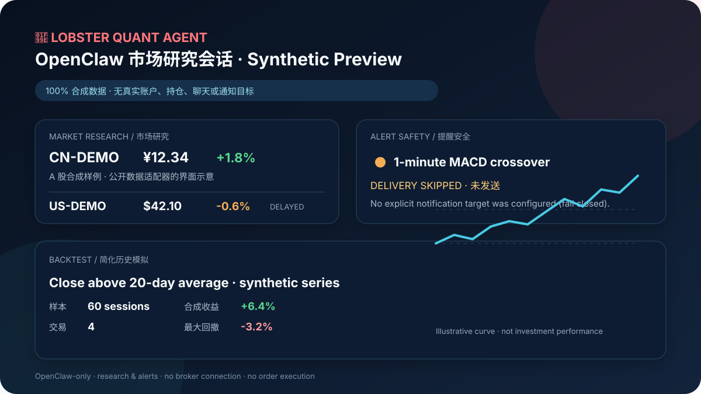

# 🦞 Lobster Quant Agent

**把 OpenClaw 变成面向 A 股与美股的本地研究、提醒和回测助手，同时不接券商、不下单。**

**Turn OpenClaw into a local A-share and US-market research, alert, and backtesting assistant—without broker access or order execution.**

[简体中文](#中文简介) · [English](#english-overview) · [安装](#安装) · [Install](#install) · [安全与隐私](#安全与隐私--safety--privacy)

> OpenClaw is the only supported runtime. This project provides research and alerts, not investment advice. It cannot place, modify, or cancel orders.



The preview above is generated from [purpose-built synthetic data](docs/demo/README.md). It contains no real account, holding, watchlist, chat identity, notification target, or live result.

## 中文简介

Lobster Quant Agent 将行情查询、报告、条件提醒、自然语言策略盯盘和历史回测收进一个 OpenClaw 工具 `lobster_quant`。它适合已经使用 OpenClaw、希望通过聊天渠道完成研究工作流，但不希望工具触碰券商账户或交易权限的用户。

| 能力 | 当前范围 |
| --- | --- |
| A 股研究 | 个股/指数行情、K 线、龙虎榜、市场宽度、盘前简报、盘后复盘 |
| 美股研究 | 延迟的美股个股与指数快照；只作为研究参考 |
| 提醒与盯盘 | 普通阈值提醒、自然语言策略监控；未配置明确目标时拒绝发送 |
| 回测 | 日线、5 分钟、1 分钟；费用、滑点、止损、交易明细、指标与本地 HTML 图表 |
| 对话渠道 | Telegram、OpenClaw 微信扩展、可选 `qqbot` QQ 扩展 |
| 隐私 | 观察池、持仓标签、提醒状态、缓存和回测结果保存在用户指定的本地私有目录 |
| 交易边界 | 无券商连接、无交易接口、无下单/改单/撤单能力 |

### 它刻意不做什么

- 不把 Codex、Claude Code 或 Python CLI 宣传为独立运行时；它们只可协助安装和开发。
- 不接收、恢复或托管用户的频道凭据、账户标识或通知目标。
- 不在安装或验证时发送消息、启动监控、调用模型 ping 或执行任何交易动作。
- 不把回测、延迟行情或缓存数据包装成实时信号、收益承诺或个性化投资建议。

## 安装

候选版本要求：macOS 或 Linux、OpenClaw `>=2026.5.17`、Node.js `>=22.22.3`、Python `>=3.10`、npm 和 Git。详见 [兼容性说明](COMPATIBILITY.md)。

当前候选尚未发布到 ClawHub。审阅期间请从源码安装：

```bash
git clone https://github.com/cnan5336-dev/lobster-quant-agent.git
cd lobster-quant-agent
./scripts/install.sh
```

ClawHub 发布并经安全扫描通过后，计划使用：

```bash
openclaw plugins install clawhub:@cnan5336-dev/lobster-quant-agent
```

如先公开 `0.2.0-rc.1` 供候选测试，应使用精确版本或 `@rc`，不要把候选版标成稳定 `latest`。

安装脚本对同一 checkout 可重复执行。它会创建仓库内的 Python 虚拟环境、安装依赖、验证并链接插件、生成被 Git 忽略的本地配置副本，并只向 OpenClaw 写入非敏感的插件路径与安全默认值。它不会发送消息、启动监控、配置凭据或执行交易。

希望由安装助手带着完成？克隆后把 [INSTALL_WITH_AGENT.md](INSTALL_WITH_AGENT.md) 交给 Codex 或 Claude Code。涉及凭据、通知目标或真实外部发送时，助手必须停下并交还给用户确认。

### 配置

安全模板位于 [config/lobster-quant-agent.example.json](config/lobster-quant-agent.example.json)。安装器会生成被忽略的 `config/lobster-quant-agent.local.json`，它只用于记录本地选择，不应成为密钥存储。

1. 使用你自己的凭据，在 OpenClaw 内配置 Telegram、微信或 QQ。优先使用 OpenClaw SecretRefs 或交互式频道配置。
2. 将 `defaultChannel` 设为 `telegram`、`weixin` 或 `qq`。
3. 可选：填写 OpenClaw 模型键 `primaryModel` 与最多两个 `fallbackModels`。
4. 主动提醒默认关闭。只有在明确配置本地 `notificationTargets` 后，才把对应频道加入 `notifyChannels`。
5. 先做无发送验证：

```bash
openclaw config validate
openclaw plugins inspect lobster-quant-agent --runtime --json
./scripts/validate.sh
```

还可以先运行完全离线、无写入的合成演示：

```bash
python3 python/lobster_quant_agent/cli.py demo
python3 scripts/first_use_smoke.py
```

第二条命令只在临时状态目录中验证固定报告、合成回测和通知目标缺失时的 fail-closed 行为；它不请求网络、不发送消息，也不执行交易动作。

### 示例问题

```text
查一下 600519 行情
查看美股 AAPL 行情
查看美股指数
查今天龙虎榜
给我一份盘前简报
来个完整版盘后复盘
观察池加入 600519 贵州茅台
设置策略盯盘：510050 一分钟 MACD 金叉时提醒
买入条件：收盘价站上20日均线；卖出条件：跌破买入价5%。回测510050最近60天，日线
生成回测图形
```

这些文字只是功能示例，不代表推荐、实际持仓、既有提醒或历史成绩。

## English overview

Lobster Quant Agent puts quote lookup, research reports, conditional alerts, natural-language strategy monitoring, and historical backtesting behind one OpenClaw tool: `lobster_quant`.

- **A-shares:** stock and index snapshots, K-lines, 龙虎榜 data, breadth, morning reports, and post-market reviews.
- **US markets:** delayed US stock and index snapshots for research context.
- **Alerts:** threshold and natural-language strategy monitoring. Delivery fails closed when an explicit target is missing.
- **Backtests:** daily, 5-minute, and 1-minute bars with simplified fees, slippage, stop conditions, trades, metrics, and local HTML charts.
- **Channels:** Telegram, the OpenClaw WeChat extension, and optional QQ through `qqbot`.
- **Privacy:** watchlists, holdings labels, alert state, caches, and generated backtests remain in a user-selected local state directory outside the repository.
- **Hard boundary:** no broker integration and no order placement, modification, or cancellation.

## Install

Release-candidate requirements are macOS or Linux, OpenClaw `>=2026.5.17`, Node.js `>=22.22.3`, Python `>=3.10`, npm, and Git. See [COMPATIBILITY.md](COMPATIBILITY.md).

This candidate is not published to ClawHub yet. During review, install from source:

```bash
git clone https://github.com/cnan5336-dev/lobster-quant-agent.git
cd lobster-quant-agent
./scripts/install.sh
```

After a maintainer publishes the reviewed package and ClawHub security checks pass, the planned install command is:

```bash
openclaw plugins install clawhub:@cnan5336-dev/lobster-quant-agent
```

If `0.2.0-rc.1` is published for candidate testing first, use the exact version or the `@rc` tag; do not present the candidate as stable `latest`.

The installer is idempotent for the same checkout. It creates a repository-local Python virtual environment, installs dependencies, validates and links the plugin, creates an ignored local configuration copy, and writes only non-secret plugin paths and safe defaults to OpenClaw. It does not send a message, start monitoring, configure credentials, or perform a trade.

Before adding any channel or credential, run the no-network synthetic path:

```bash
python3 python/lobster_quant_agent/cli.py demo
python3 scripts/first_use_smoke.py
```

The smoke test uses a temporary state directory and makes zero network requests, message sends, or broker actions.

For agent-guided setup, give [INSTALL_WITH_AGENT.md](INSTALL_WITH_AGENT.md) to Codex or Claude Code after cloning. OpenClaw remains the runtime; setup assistants must stop for any credential, private destination, or real external-send decision.

## Architecture

```text
Telegram / WeChat / QQ
          │
       OpenClaw
          │  lobster_quant tool
  TypeScript plugin adapter
          │  explicit argv + private env config
  Python research core + CLI
      ├── A-share / delayed US-market adapters
      ├── reports + channel renderers
      ├── local watchlist / strategy monitor
      ├── natural-language backtest engine
      └── fallback data sources + private local cache
```

The Python CLI is an internal plugin layer for deterministic development and testing. It is not a supported standalone product or cross-agent runtime.

## Contributor and release checks

```bash
npm install --omit=peer
python3 -m venv .venv
.venv/bin/pip install -r python/requirements.txt
./scripts/validate.sh
```

The suite compiles Python, runs deterministic unit tests, exercises strategy parsing in a temporary no-write state directory, validates generated OpenClaw metadata, runs TypeScript tests, checks dependency vulnerabilities, verifies the synthetic demo and npm package payload, and performs a repository privacy audit.

Maintainers should also follow [MAINTAINERS.md](MAINTAINERS.md) and the [local ClawHub release procedure](docs/CLAWHUB_RELEASE.md). Release notes for the current candidate are in [CHANGELOG.md](CHANGELOG.md).

## 安全与隐私 / Safety & privacy

- Public market endpoints may be delayed, unavailable, rate-limited, stale, or structurally changed. The US adapter uses a public Yahoo Finance chart endpoint and must be treated as delayed research data.
- 龙虎榜 and some breadth/news workflows depend on AkShare and its upstream sources.
- Minute history can be shorter than requested. Cache fallback is labeled and may be stale.
- Backtests are simplified simulations; they do not fully model liquidity, price limits, corporate actions, or real execution.
- Monitoring is local and opt-in. Notification delivery fails closed when a channel target is missing.
- The monitor uses POSIX file locks, so Windows is not supported in this release candidate.
- Never commit local OpenClaw configuration, credentials, channel/account identifiers, notification targets, watchlists, holdings, state, caches, logs, screenshots, or generated results.

See [SECURITY.md](SECURITY.md), [CONTRIBUTING.md](CONTRIBUTING.md), and [DISCLAIMER.md](DISCLAIMER.md). Licensed under the [MIT License](LICENSE).
